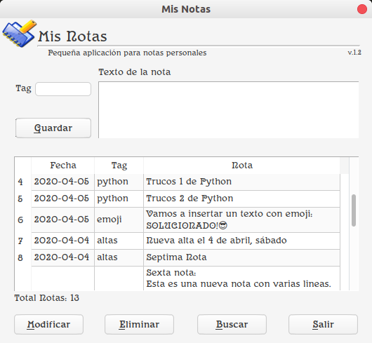

<h1>Mis Notas</h1>

    

## Una simple aplicación para tomar notas  
## <i>A simple application to take notes</i>
Hecha en Python 3.6.7 + PyQt5 + SQLite 3  
Versión para Linux, testada únicamente en Ubuntu Budgie 18.04.4 LTS  

<i>Made with Python 3.6.7 + PyQt5 + SQLite 3</i>  
<i>Linux version, tested only on Ubuntu Budgie 18.04.4 LTS</i>  
  
Fernando Souto (donanpher@gmail.com)  
A Coruña (Galicia), Spain  
Abril 2020 (durante la cuarentena del #Coronavirus #SARS-CoV-2 #Covid-19)  
<i>April 2020 (during the #Coronavirus # SARS-CoV-2 # Covid-19 quarantine)</i>  

---

---
## Instalación en Linux <i>(Linux installation)</i>
* <a href="https://drive.google.com/file/d/1Y3UEnAjLV4oks4N5Ix0u5Ih7jYoVv9t3/view?usp=sharing">Descargar MisNotas.zip (46 MB)</a>
* Descomprimelo en una nueva carpeta, por ejemplo /opt/misnotas/
* Ejecuta MisNotas (es un único fichero ejecutable con todas las dependencias ya incluidas)
---
* <i><a href="https://drive.google.com/file/d/1Y3UEnAjLV4oks4N5Ix0u5Ih7jYoVv9t3/view?usp=sharing">Download MisNotas.zip (46 MB)</a></i>   
* <i>Unzip it into a new folder, for example /opt/misnotas/</i>   
* <i>Run MisNotas (it's a single file with all dependencies included)</i>   
---
## Dependencias:  <i>(Dependencies)</i>
Python 3.6.7, PyQt5, SQLite 3  

---
## Descripción General <i>(General Description)</i>
Sencilla aplicación para tomar notas.  
(es mi primera aplicación hecha con PyQt5 y me ha servido como introducción y aprendizaje)  
<i>Simple application for taking notes</i>  
<i>It is my first application made with PyQt5 and it has served as an introduction and learning</i>  

--- 
